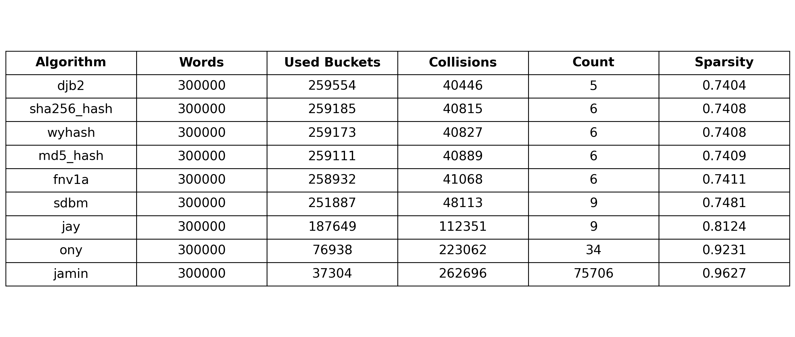

# Hash Function Comparison Project

  

This project compares multiple string hash functions by testing how evenly they distribute a large set of words across a fixed-size hash table.

  

The program automatically loads every hash function from the `hash_functions` folder, evaluates each one using word data from a CSV file, and generates a results table as a PNG image.

  

## Project Structure

  


```text
project/
|
+-- data/
|   +-- unigram_freq.csv
|
+-- hash_functions/
|   +-- __init__.py
|   +-- hash_function_1.py
|   +-- hash_function_2.py
|   +-- ...
|
+-- main.py
+-- hash_results_2000000.png
+-- README.md
```


  
  

# Folder Description

## hash_functions/

  

- The **hash_functions** folder contains all hash function implementations used in the comparison.

  

- Each Python file in this folder represents one hash algorithm. The program automatically scans this folder and imports every .py file except __init__.py.

 - Each hash function file must contain a function named **hash_string**

> Example:

  
```Python
def hash_string(s):
	hash_value = 0
	for char in s:
		hash_value = hash_value * 31 + ord(char)
	return hash_value
```
  

- If a file does not contain a hash_string function, the program skips it and prints a warning.

  

## Data

  

- The program reads words from **data/unigram_freq.csv**

- The CSV file should contain at least the following columns: word , count
- Only the first 300,000 words are used during the comparison.

  
## How the Program Works

  

### The program performs the following steps:

1. Loads all hash functions from the hash_functions folder.
2. Reads word data from data/unigram_freq.csv.
3. Uses each hash function to assign words to buckets in a hash table.
4. Measures how well each hash function distributes the words.
5. Sorts the results by the number of collisions.
6. Saves the comparison results as a PNG table.


# Hash Table Size
- The hash table size used in the experiment is **TABLE_SIZE = 1_000_000**
- Each word is assigned to a bucket using:
- index = hash_string(word) % TABLE_SIZE

# Metrics
The generated table includes the following metrics:
		1. Metric Description
		2. Algorithm Name of the hash function file
		3. Words Total number of words tested
		4. Used Buckets Number of buckets that received at least one word
		5. Collisions Number of times multiple words were placed in the same bucket
		6. Count Maximum number of words placed in a single bucket
		7. Sparsity Percentage of unused buckets in the hash table

# Results
- The output table is saved as: **hash_results_1000000.png**

- The generated image is shown below:

  

# Running the Project
To run the project, use: 
1. **python main.py** to directly print the table in the command line
2. **python main_pic.py** to directly generate a picture of the comparison results

  

# Requirements
This project uses the following Python libraries:
- csv
- os
- importlib
- matplotlib

### Install Matplotlib if it is not already installed:

  
```
pip install matplotlib
```

# Purpose
The goal of this project is to compare different hash functions and observe how well they distribute words across a large hash table. A good hash function should minimize collisions and spread values evenly across the available buckets.
